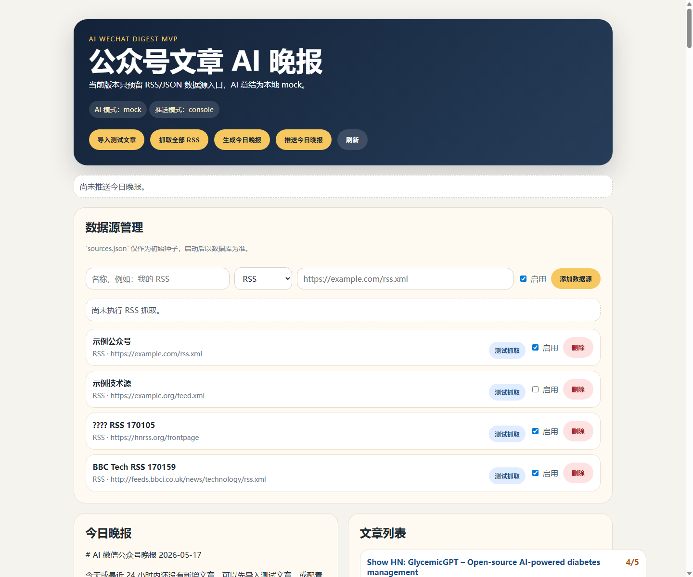
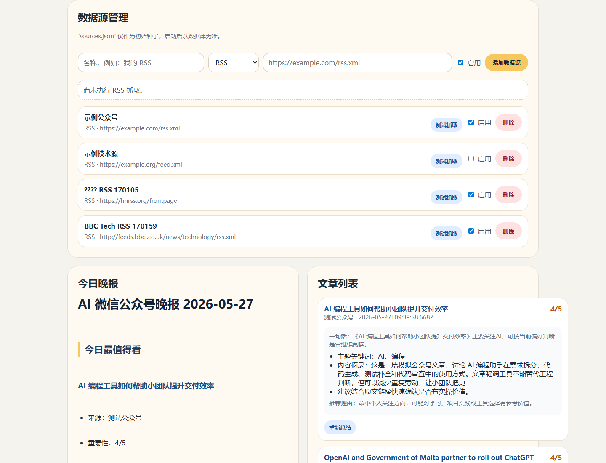
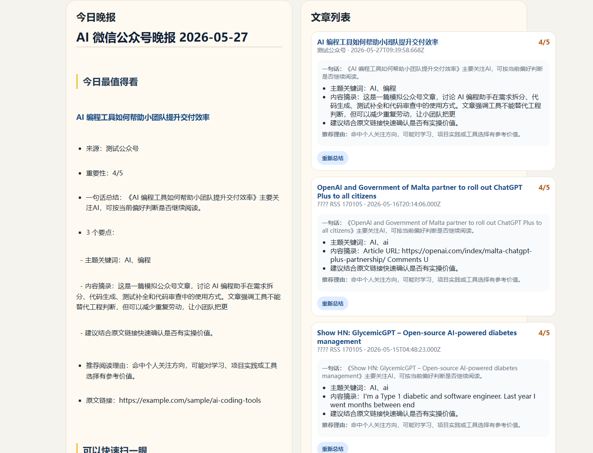
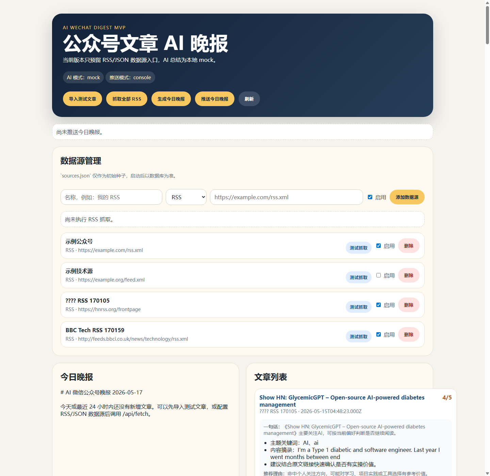
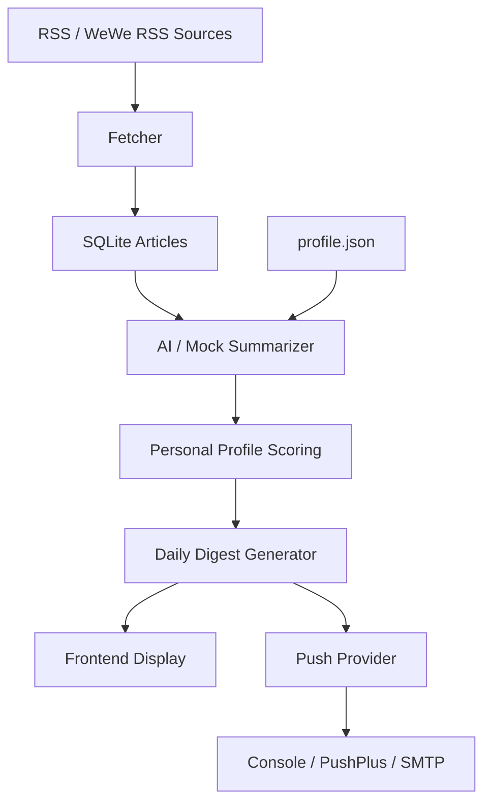

# AI WeChat Digest MVP

An AI-powered daily digest MVP for filtering and summarizing technical RSS articles with personal preference scoring, mock/LLM summarization, Markdown digest generation, and push delivery hooks.

[中文说明](./README_CN.md)

## Demo Preview

Home page:



Source management:



Digest generation:



Console push result:



## Why This Project

Technical readers follow many RSS feeds, public accounts, and community updates every day. The information volume is high, but most content does not deserve deep reading. This project explores a lightweight personal digest workflow:

- Collect articles from RSS-compatible sources
- Summarize them with AI (or mock for demo)
- Rank by personal preference
- Generate a structured daily report
- Deliver through push hooks

## Features

- **RSS source management**: add, enable, disable, delete sources
- **RSS fetch and deduplication**: fetch enabled sources, deduplicate by URL
- **Sample article import**: import demo articles, refresh dates for demo readiness
- **AI summarization**: mock (default), DeepSeek/OpenAI-compatible, Ollama local LLM
- **Personal profile scoring**: local `profile.json` (falling back to `profile.example.json`) influences AI prompt and mock scoring
- **Markdown daily digest**: grouped by importance (must-read / quick-scan / skippable)
- **Formatted digest rendering**: frontend renders Markdown with proper headings, lists, and links
- **Page-level notice feedback**: success/error/info notices instead of alert popups
- **Push delivery hooks**: console / PushPlus / SMTP email
- **Docker support**: ready for containerized deployment

## Tech Stack

- **Backend**: Node.js, Express
- **Database**: SQLite via Node built-in `node:sqlite`
- **RSS parsing**: rss-parser
- **AI**: mock, OpenAI-compatible chat completions, Ollama `/api/chat`
- **Push**: console, PushPlus, nodemailer SMTP
- **Frontend**: plain HTML / CSS / JavaScript
- **Deployment**: Docker / Docker Compose

## Architecture



## Quick Start

Node.js `22.5+` is recommended because this project uses Node's built-in SQLite module.

```bash
cd backend
npm ci
npm run dev
```

Open `http://localhost:3090`.

The app uses `backend/data/profile.example.json` when no local profile exists. Copy it to `backend/data/profile.json` to customize preferences. The local profile and SQLite runtime files are ignored by Git and excluded from Docker builds.

### Demo Flow

1. Click "导入测试文章" (Import Sample Articles)
2. Click "生成今日晚报" (Generate Today's Digest)
3. View the formatted Markdown digest
4. Click "推送今日晚报" (Push Today's Digest) to see console output

## AI Provider Modes

| Mode | Description | API Key Required |
|------|-------------|------------------|
| `mock` | Default mode, keyword-based scoring, no API calls | No |
| `deepseek` | OpenAI-compatible chat completions (DeepSeek, OpenAI, etc.) | Yes |
| `ollama` | Local LLM endpoint | No (local) |

### DeepSeek / OpenAI Compatible

```env
AI_PROVIDER=deepseek
AI_API_BASE_URL=https://api.deepseek.com/v1
AI_API_KEY=your-api-key
AI_MODEL=deepseek-chat
```

### Ollama Local

```env
AI_PROVIDER=ollama
OLLAMA_URL=http://127.0.0.1:11434
OLLAMA_MODEL=qwen2.5:3b
```

When real AI calls fail, timeout, or return invalid JSON, the system automatically falls back to mock mode.

## Environment Variables

Copy `backend/.env.example` to `backend/.env` to customize settings.

| Variable | Default | Description |
|----------|---------|-------------|
| `PORT` | `3090` | Server port |
| `ENABLE_SCHEDULER` | `false` | Enable daily 22:30 cron job |
| `ENABLE_DAILY_PUSH` | `false` | Auto-push after scheduled digest |
| `AI_PROVIDER` | `mock` | AI mode: `mock`, `deepseek`, `ollama` |
| `AI_API_BASE_URL` | - | OpenAI-compatible API base URL |
| `AI_API_KEY` | - | API key for DeepSeek/OpenAI |
| `AI_MODEL` | - | Model name |
| `OLLAMA_URL` | `http://127.0.0.1:11434` | Ollama endpoint |
| `OLLAMA_MODEL` | `qwen2.5:3b` | Ollama model |
| `PUSH_PROVIDER` | `console` | Push mode: `console`, `pushplus`, `email` |
| `PUSHPLUS_TOKEN` | - | PushPlus token |
| `SMTP_HOST` | - | SMTP server host |
| `SMTP_PORT` | - | SMTP server port |
| `SMTP_USER` | - | SMTP username |
| `SMTP_PASS` | - | SMTP password |
| `SMTP_FROM` | - | Sender email |
| `SMTP_TO` | - | Recipient email |

## API Overview

| Method | Path | Description |
|--------|------|-------------|
| GET | `/api/health` | Health check |
| GET | `/api/sources` | List all sources |
| POST | `/api/sources` | Create source |
| PATCH | `/api/sources/:id` | Update source |
| DELETE | `/api/sources/:id` | Delete source |
| POST | `/api/sources/:id/test-fetch` | Test fetch single source |
| POST | `/api/fetch` | Fetch all enabled sources |
| GET | `/api/articles` | List articles |
| POST | `/api/articles/import-sample` | Import sample articles |
| POST | `/api/articles/:id/resummarize` | Re-summarize single article |
| POST | `/api/digest/generate` | Generate today's digest |
| GET | `/api/digest/today` | Get today's digest |
| POST | `/api/push/today` | Push today's digest |
| GET | `/api/config/ai` | Public AI config (no secrets) |
| GET | `/api/config/push` | Public push config (no secrets) |

## Docker

```bash
docker compose up --build
```

The app is exposed at `http://localhost:3090`.

The current Compose file is intended for a disposable local demo and does not mount a persistent database volume. Removing and recreating the container resets its SQLite data.

## Local Data Boundaries

- `backend/data/app.db` and its SQLite WAL/SHM files are generated locally and ignored.
- `backend/data/profile.json` is a local preference file and ignored; `profile.example.json` is the tracked, sanitized structure example.
- `backend/data/sources.json` contains public demo RSS seeds. Sources added through the UI are stored in the local SQLite database.
- Generated articles and digests are stored in SQLite, not committed as files.
- `.env` files, API keys, PushPlus tokens, and SMTP credentials must remain local.

## What I Learned

- **End-to-end MVP design**: from RSS ingestion to formatted digest display
- **LLM provider fallback**: automatic fallback to mock when AI fails
- **RSS ingestion and deduplication**: handle unreliable feeds gracefully
- **Safe Markdown rendering**: HTML escape + URL sanitize before rendering
- **Demo-friendly sample refresh**: ensure demo data always enters today's digest
- **Minimal dependency frontend**: no build tools, no frameworks, just vanilla JS

## Limitations

- Not a production CMS or content platform
- No user authentication or multi-user support
- Lightweight Markdown renderer only supports basic syntax (headings, lists, bold, links)
- WeChat official account publishing is not implemented (only push delivery hooks)
- SQLite is suitable for local MVP, not large-scale deployment
- No unit tests yet

## Roadmap

- Real WeChat official account integration examples
- Article search and filter improvements
- Scheduled digest time configuration
- GitHub Actions CI
- Better screenshots and demo video
- Unit tests
- JSON source support
- Digest history and archive

## Disclaimer

This project does not scrape WeChat directly. It does not include WeChat login, anti-bot bypassing, or restricted-content scraping logic. It only consumes RSS-compatible feeds, including WeWe RSS or other lawful sources provided by the user.

## License

This project is licensed under the [MIT License](LICENSE).
