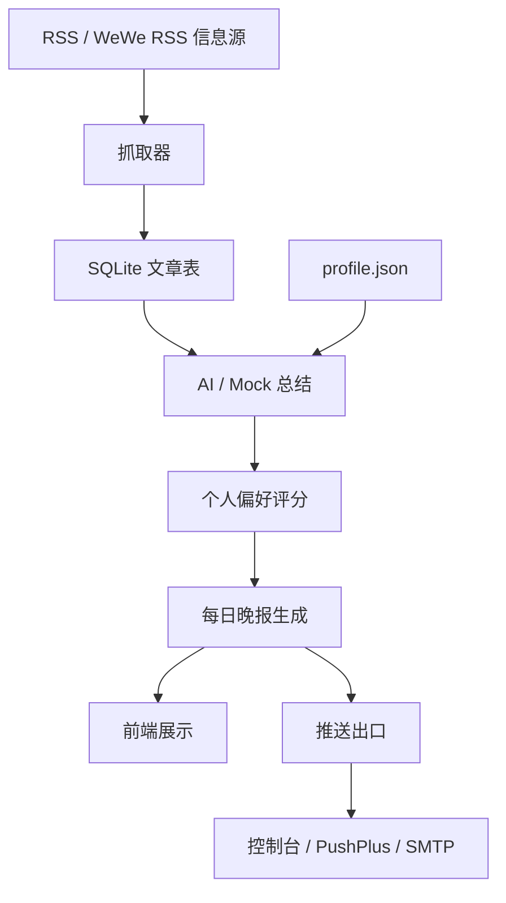

# AI 微信公众号晚报 MVP

一个面向 AI 技术资讯筛选的个人晚报工具 MVP，支持 RSS 数据源管理、文章抓取、AI/Mock 总结、个人偏好筛选、Markdown 晚报生成和推送出口。

[English README](./README.md)

## 项目解决的问题

技术读者每天关注很多 RSS 源、公众号、社区更新，信息量大但值得精读的内容不多。这个项目探索一个轻量的个人晚报工作流：

- 从 RSS 兼容信息源收集文章
- 用 AI（或 Mock）生成摘要
- 按个人偏好评分
- 生成结构化每日晚报
- 通过推送出口投递

## 功能特性

- **数据源管理**：新增、启停、删除 RSS 数据源；JSON 抓取尚未实现
- **RSS 抓取与去重**：抓取启用的数据源，按 URL 去重入库
- **测试文章导入**：内置 5 篇模拟文章，支持刷新日期保证演示可用
- **AI 总结**：支持 Mock（默认）、DeepSeek/OpenAI 兼容接口、本地 Ollama
- **个人偏好评分**：本地 `profile.json` 参与 AI prompt 和 Mock 评分；不存在时使用 `profile.example.json`
- **Markdown 晚报生成**：按重要性分为"今日最值得看 / 可以快速扫一眼 / 可以跳过"
- **格式化晚报展示**：前端渲染 Markdown，支持标题、列表、加粗、链接
- **页面内提示**：成功/错误/信息提示替代 alert 弹窗
- **推送出口**：控制台 / PushPlus / SMTP 邮箱
- **Docker 支持**：容器化部署

## 技术栈

- **后端**：Node.js、Express
- **数据库**：Node 内置 `node:sqlite`
- **RSS 解析**：rss-parser
- **AI 适配**：Mock、OpenAI 兼容接口、Ollama `/api/chat`
- **推送**：控制台、PushPlus、nodemailer SMTP
- **前端**：原生 HTML / CSS / JavaScript
- **部署**：Docker / Docker Compose

## 系统流程



## 快速启动

建议使用 Node.js `22.5+`，项目使用 Node 内置 SQLite 能力。

```bash
cd backend
npm ci
npm run dev
```

访问：`http://localhost:3090`

如果没有本地偏好文件，程序会使用 `backend/data/profile.example.json`。需要自定义时，将它复制为 `backend/data/profile.json` 后修改。本地 profile 和 SQLite 运行文件都已被 Git 忽略，也不会进入 Docker 构建。

### 演示流程

1. 点击"导入测试文章"
2. 点击"生成今日晚报"
3. 查看格式化 Markdown 晚报
4. 点击"推送今日晚报"查看控制台输出

## AI 模式说明

| 模式 | 说明 | 是否需要 API Key |
|------|------|------------------|
| `mock` | 默认模式，基于关键词评分，不调用 AI | 否 |
| `deepseek` | OpenAI 兼容接口（DeepSeek、OpenAI 等） | 是 |
| `ollama` | 本地 LLM 端点 | 否（本地） |

### DeepSeek / OpenAI 兼容

```env
AI_PROVIDER=deepseek
AI_API_BASE_URL=https://api.deepseek.com/v1
AI_API_KEY=你的 API Key
AI_MODEL=deepseek-chat
```

### Ollama 本地

```env
AI_PROVIDER=ollama
OLLAMA_URL=http://127.0.0.1:11434
OLLAMA_MODEL=qwen2.5:3b
```

当真实 AI 调用失败、超时或返回无效 JSON 时，系统自动回退到 Mock 模式。

## 环境变量说明

复制 `backend/.env.example` 为 `backend/.env` 后按需修改。

| 变量 | 默认值 | 说明 |
|------|--------|------|
| `PORT` | `3090` | 服务端口 |
| `ENABLE_SCHEDULER` | `false` | 启用每日 22:30 定时任务 |
| `ENABLE_DAILY_PUSH` | `false` | 定时任务后自动推送 |
| `AI_PROVIDER` | `mock` | AI 模式：`mock`、`deepseek`、`ollama` |
| `AI_API_BASE_URL` | - | OpenAI 兼容 API 地址 |
| `AI_API_KEY` | - | API Key |
| `AI_MODEL` | - | 模型名称 |
| `OLLAMA_URL` | `http://127.0.0.1:11434` | Ollama 端点 |
| `OLLAMA_MODEL` | `qwen2.5:3b` | Ollama 模型 |
| `PUSH_PROVIDER` | `console` | 推送模式：`console`、`pushplus`、`email` |
| `PUSHPLUS_TOKEN` | - | PushPlus Token |
| `SMTP_HOST` | - | SMTP 服务器地址 |
| `SMTP_PORT` | - | SMTP 端口 |
| `SMTP_USER` | - | SMTP 用户名 |
| `SMTP_PASS` | - | SMTP 密码 |
| `SMTP_FROM` | - | 发件人邮箱 |
| `SMTP_TO` | - | 收件人邮箱 |

## API 概览

| 方法 | 路径 | 说明 |
|------|------|------|
| GET | `/api/health` | 健康检查 |
| GET | `/api/sources` | 获取数据源列表 |
| POST | `/api/sources` | 新增数据源 |
| PATCH | `/api/sources/:id` | 更新数据源 |
| DELETE | `/api/sources/:id` | 删除数据源 |
| POST | `/api/sources/:id/test-fetch` | 测试单个数据源 |
| POST | `/api/fetch` | 抓取全部启用数据源 |
| GET | `/api/articles` | 获取文章列表 |
| POST | `/api/articles/import-sample` | 导入测试文章 |
| POST | `/api/articles/:id/resummarize` | 重新总结单篇文章 |
| POST | `/api/digest/generate` | 生成今日晚报 |
| GET | `/api/digest/today` | 获取今日晚报 |
| POST | `/api/push/today` | 推送今日晚报 |
| GET | `/api/config/ai` | AI 配置（不含密钥） |
| GET | `/api/config/push` | 推送配置（不含密钥） |

## Docker 启动

```bash
docker compose up --build
```

默认映射端口：`3090:3090`

当前 Compose 配置用于一次性本地演示，没有挂载持久化数据库卷。删除并重新创建容器会重置其中的 SQLite 数据。

## 本地数据边界

- `backend/data/app.db` 及 SQLite WAL/SHM 文件由本地运行生成并被忽略。
- `backend/data/profile.json` 是本地偏好配置并被忽略；仓库只跟踪脱敏结构示例 `profile.example.json`。
- `backend/data/sources.json` 只包含公开演示 RSS seed；通过页面新增的数据源保存在本地 SQLite。
- 抓取文章和生成晚报都存储在 SQLite 中，不以生成文件形式提交。
- `.env`、API Key、PushPlus Token 和 SMTP 凭据必须保留在本地。

## 项目截图

### 首页


### 数据源管理


### 晚报生成


### 控制台推送结果


## 项目亮点

- **端到端 MVP 设计**：从 RSS 抓取到格式化晚报展示的完整链路
- **LLM 回退机制**：AI 调用失败时自动回退到 Mock 模式
- **RSS 抓取与去重**：优雅处理不稳定的数据源
- **安全 Markdown 渲染**：先 HTML 转义再渲染，URL 过滤危险协议
- **演示数据刷新**：测试文章支持刷新日期，保证演示时能生成今日晚报
- **零依赖前端**：无构建工具、无框架，纯原生 JS

## 当前局限

- 不是生产级 CMS 或内容平台
- 无用户认证或多用户支持
- 轻量 Markdown 渲染器只支持基础语法（标题、列表、加粗、链接）
- 未实现微信公众号自动发布（只有推送出口框架）
- SQLite 适合本地 MVP，不适合大规模部署
- 暂无单元测试

## 后续计划

- WeWe RSS 实际接入示例
- 文章搜索与筛选改进
- 定时任务时间配置
- GitHub Actions CI
- 更好的截图和演示视频
- 单元测试
- JSON 数据源支持
- 晚报历史与归档

## 当前边界说明

本项目不直接爬取微信，不包含微信登录、反爬、绕过访问限制或批量采集微信页面的逻辑。项目只接收 RSS、WeWe RSS 或其他合法、授权、RSS-compatible 的信息源。

如果需要接入公众号内容，推荐在外部合法部署 WeWe RSS 或其他 RSS 生成工具，再把生成的 RSS URL 添加到本项目。

## 许可证

本项目采用 [MIT License](LICENSE)。
