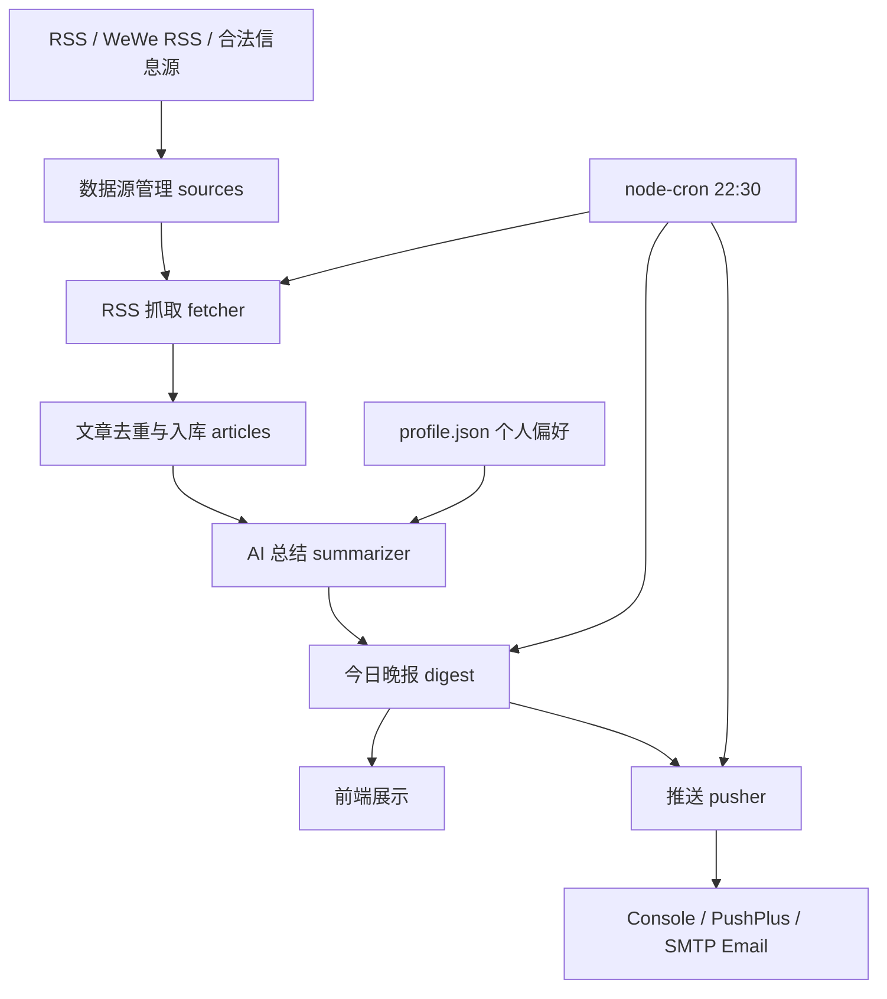

# AI 微信公众号 / RSS 信息晚报助手

[English README](./README.md)

这是一个面向个人信息流管理的 AI 晚报助手。项目可以从 RSS、WeWe RSS 或其他合法信息源抓取文章，使用 mock / DeepSeek / Ollama 生成结构化摘要，并把当天内容整理成 Markdown 晚报，支持控制台、PushPlus、SMTP 邮箱推送框架。

当前定位是作品集级 MVP：功能链路完整、默认配置安全、便于本地演示和后续扩展。

## 核心功能

- 数据源管理：支持新增、启停、删除 RSS/JSON 数据源。
- RSS 抓取：从启用的 RSS 源抓取文章，按 URL 去重入库。
- 测试抓取：单个数据源可预览前 5 篇文章，不写入数据库。
- 测试文章导入：内置 5 篇模拟文章，便于无外网时演示。
- AI 总结：支持 mock、DeepSeek/OpenAI 兼容接口、本地 Ollama。
- 个人偏好：`profile.json` 用于影响 AI prompt 和 mock 评分。
- 晚报生成：按重要性分为“今日最值得看 / 可以快速扫一眼 / 可以跳过”。
- 手动重总结：单篇文章可重新生成摘要和评分。
- 推送框架：支持 console、PushPlus、SMTP 邮箱，默认只打印到控制台。
- 定时任务：可在每天 22:30 自动抓取 RSS、生成晚报，并可选推送。

## 技术栈

- 后端：Node.js、Express
- 定时任务：node-cron
- 数据库：Node 内置 `node:sqlite`
- RSS 解析：rss-parser
- AI 适配：mock、OpenAI compatible chat completions、Ollama `/api/chat`
- 推送：console、PushPlus、nodemailer SMTP
- 前端：原生 HTML / CSS / JavaScript
- 配置：dotenv
- 部署：Docker / Docker Compose

## 项目亮点

- 不依赖真实 AI Key 也能完整演示，默认 mock 保证开箱即用。
- AI Provider 和 Push Provider 都有 fallback / 配置检查，不让演示流程中断。
- RSS、AI、摘要、推送分层清晰，便于替换 WeWe RSS、DeepSeek、Ollama、PushPlus。
- 用 SQLite 降低部署成本，适合个人服务器、NAS、开发机和作品集展示。
- 前端保持轻量，无 React/Vue 构建链，适合快速理解端到端链路。

## 架构流程图



## 截图占位

> 当前仓库只预留截图位置，不提交真实截图。

- 首页截图：`docs/images/home-placeholder.png`
- 数据源管理截图：`docs/images/sources-placeholder.png`
- 晚报生成截图：`docs/images/digest-placeholder.png`
- 推送结果截图：`docs/images/push-placeholder.png`

## 项目结构

```text
backend/
  src/
    aiProvider.js
    db.js
    digest.js
    fetcher.js
    pusher.js
    sampleImporter.js
    scheduler.js
    server.js
    summarizer.js
  data/
    profile.json
    sample-articles.json
    sources.json
  package.json
  .env.example
frontend/
  index.html
  app.js
  style.css
docs/
  demo-script.md
  project-summary.md
  images/.gitkeep
Dockerfile
docker-compose.yml
README.md
README_CN.md
```

## 快速启动

建议使用 Node.js `22.5+`。项目使用 Node 内置 SQLite 能力，避免安装原生 SQLite 编译依赖。

```bash
cd backend
npm install
npm run dev
```

访问：`http://localhost:3090`

健康检查：`http://localhost:3090/api/health`

## Docker 启动

```bash
docker compose up --build
```

默认映射端口：`3090:3090`

Docker 镜像不会复制 `node_modules`、`.env`、`backend/data/app.db` 或数据库运行文件。SQLite 数据库会在容器运行时生成。

## 环境变量说明

复制 `backend/.env.example` 为 `backend/.env` 后按需修改。默认配置不调用真实 AI，也不会真实推送。

```env
PORT=3090
ENABLE_SCHEDULER=false
ENABLE_DAILY_PUSH=false
AI_PROVIDER=mock
AI_API_BASE_URL=
AI_API_KEY=
AI_MODEL=
OLLAMA_URL=http://127.0.0.1:11434
OLLAMA_MODEL=qwen2.5:3b
PUSH_PROVIDER=console
PUSHPLUS_TOKEN=
SMTP_HOST=
SMTP_PORT=
SMTP_USER=
SMTP_PASS=
SMTP_FROM=
SMTP_TO=
```

`ENABLE_SCHEDULER=true`：开启每天 22:30 的定时任务，自动抓取 RSS 并生成晚报。

`ENABLE_DAILY_PUSH=true`：仅在 `ENABLE_SCHEDULER=true` 时生效，表示定时任务生成晚报后自动推送。默认关闭，避免调试时误发。

## AI Provider

mock 模式：默认模式，无需 API Key，按关键词和个人偏好规则生成摘要。

DeepSeek/OpenAI 兼容接口：

```env
AI_PROVIDER=deepseek
AI_API_BASE_URL=https://api.deepseek.com/v1
AI_API_KEY=你的 API Key
AI_MODEL=deepseek-chat
```

Ollama 本地模式：

```env
AI_PROVIDER=ollama
OLLAMA_URL=http://127.0.0.1:11434
OLLAMA_MODEL=qwen2.5:3b
```

真实 AI 调用失败、超时、返回非 JSON 或字段不符合要求时，会自动 fallback 到 mock。

## 推送 Provider

console 模式：默认模式，只在服务端控制台打印今日晚报。

```env
PUSH_PROVIDER=console
```

PushPlus：

```env
PUSH_PROVIDER=pushplus
PUSHPLUS_TOKEN=你的 PushPlus Token
```

SMTP 邮箱：

```env
PUSH_PROVIDER=email
SMTP_HOST=smtp.example.com
SMTP_PORT=465
SMTP_USER=your@example.com
SMTP_PASS=你的邮箱授权码或密码
SMTP_FROM=your@example.com
SMTP_TO=target@example.com
```

配置缺失时 API 会返回明确错误，不会打印 token 或 password。

## API 总览

| 方法 | 路径 | 说明 |
| --- | --- | --- |
| GET | `/api/health` | 健康检查 |
| GET | `/api/articles` | 获取文章列表 |
| POST | `/api/articles/import-sample` | 导入测试文章 |
| POST | `/api/articles/:id/resummarize` | 重新总结单篇文章 |
| GET | `/api/sources` | 获取数据源列表 |
| POST | `/api/sources` | 新增数据源 |
| PATCH | `/api/sources/:id` | 更新数据源 |
| DELETE | `/api/sources/:id` | 删除数据源 |
| POST | `/api/sources/:id/test-fetch` | 测试单个 RSS 源 |
| POST | `/api/fetch` | 抓取全部启用 RSS 源 |
| POST | `/api/digest/generate` | 生成今日晚报 |
| GET | `/api/digest/today` | 获取今日晚报 |
| POST | `/api/push/today` | 推送今日晚报 |
| GET | `/api/config/ai` | 查看 AI 模式，不泄露 Key |
| GET | `/api/config/push` | 查看推送模式，不泄露敏感配置 |

## 推荐演示流程

1. 启动项目：`cd backend && npm run dev`
2. 打开 `http://localhost:3090`
3. 点击“导入测试文章”
4. 添加一个 RSS 源
5. 点击“测试抓取”预览 RSS 内容
6. 点击“抓取全部 RSS”写入文章
7. 点击“生成今日晚报”
8. 点击单篇文章“重新总结”
9. 点击“推送今日晚报”，console 模式会打印到服务端控制台

详细脚本见：`docs/demo-script.md`

## 当前边界说明

本项目不直接爬取微信，不包含微信登录、反爬、绕过访问限制或批量采集微信页面的逻辑。项目只接收 RSS、WeWe RSS 或其他合法、授权、RSS-compatible 的信息源。

如果需要接入公众号内容，推荐在外部合法部署 WeWe RSS 或其他 RSS 生成工具，再把生成的 RSS URL 添加到本项目。

## 后续计划

- WeWe RSS 实际接入示例
- 真实 PushPlus 推送联调
- SMTP 邮箱推送联调
- Docker 部署持久化方案
- 前端仪表盘增强
- 个人偏好评分优化
- JSON 数据源入口
- 摘要检索、标签和归档
